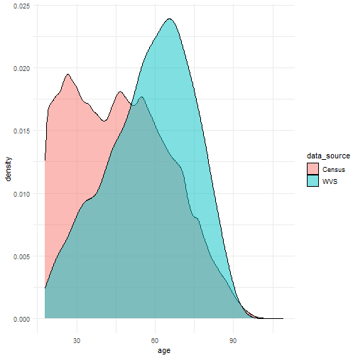
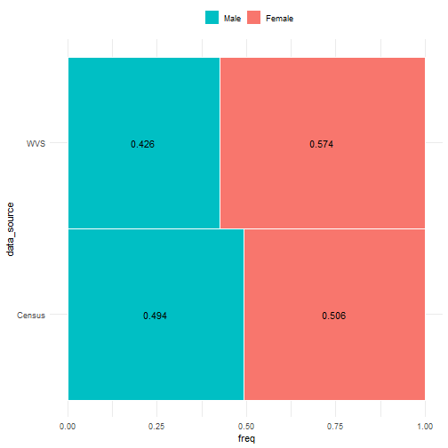

```r
library(tidyverse, quietly = TUE)
library(here, quietly = TRUE)

# Helper functions for data cleaning
source(here("R", "helpers.R"))

# Universal ggplot theming 
theme_set(theme_bw())
```

# Datasets
## Census
The dataset in use here is the [New Zealand 2018 Census totals by topic – national
highlights (updated)](https://www.stats.govt.nz/information-releases/2018-census-totals-by-topic-national-highlights-updated).


```r
census_data_dir <- "data/2018-Census-totals-by-topic-national-highlights"
```

Load all of the census highlights into a list of dataframes and perform data
cleaning common to all.


```r
census_datasets <- list.files(here(census_data_dir)) %>%
  set_names(str_replace_all,
            c("-2018-census-csv.csv$" = "",
              "-" = "_")) %>%
  map(function(dataset){
    read_csv(here(census_data_dir, dataset),
             col_types = cols(Code = col_character())) %>%
      rename_with(~"n",
                  .cols = matches("Census_usually_resident_population_count")) %>%
      filter(str_starts(Code, "Total", negate = TRUE))
  })
```

Age:


```r
census_age <- census_datasets$age_single_years %>%
  transmute(age = as.integer(Code),
         n)
```

Sex:


```r
census_sex <- census_datasets$sex
```

## WVS data
@TODO: Repeat with cleaned WVS dataset when available.


```r
nzl_raw <- read_csv(file = here("data/NZL.csv")) %>%
  code_missing()
```

Age:


```r
wvs_age <- nzl_raw %>%
  select(age = Q262) %>%
  filter(age > 0 & age <= 120)
```

Sex:


```r
wvs_sex <- nzl_raw %>%
  select(sex = Q260) %>%
  mutate(sex = factor(sex, levels = 1:2, labels = c("Male", "Female")))
```

# Checks for representativeness
## Age


The WVS sampling frame was the NZ electoral roll. Therefore, people under 18
have been systematically excluded from the survey. We need to do the same to the
census data for comparability.


```r
# Combine the WVS and census datasets for plotting.
# Expand the census summary into individual rows (all five million):
census_age_expanded <- census_age %>%
  filter(age >= 18) %>%
  with(rep(age, n))

# Denote the source of each observation in the combined dataframe.
combo_age <- rbind(
  cbind(wvs_age, data_source = "WVS"),
  data.frame(age = census_age_expanded, data_source = "Census")
)

ggplot(combo_age, aes(age, fill = data_source)) +
  geom_density(alpha = 1/2)
```



These appear to be different distributions. Test more formally with
Kolmogorov-Smirnov test:


```r
ks.test(wvs_age$age, census_age_expanded)
```

```
## 
## 	Two-sample Kolmogorov-Smirnov test
## 
## data:  wvs_age$age and census_age_expanded
## D = 0.26675, p-value < 2.2e-16
## alternative hypothesis: two-sided
```

The distribution of ages of survey respondents does not match the population,
even considering the removal of under-18s. The age distribution of
respondents is somewhat shifted to the right compared to the population -
they are older than expected if they were a representative sample.

## Sex


Have males and females responded to the survey in the same proportions
as they occur in the population?


```r
census_sex_tab <- census_sex %>%
  select(sex = Sex, n) %>%
  mutate(freq = n / sum(n))

wvs_sex_tab <- wvs_sex %>%
  na.omit() %>%
  group_by(sex) %>%
  summarise(n = n()) %>%
  mutate(freq = n / sum(n))

rbind(cbind(census_sex_tab, data_source = "Census"),
      cbind(wvs_sex_tab, data_source = "WVS")) %>%
  ggplot(aes(freq, data_source, fill = sex)) +
  geom_bar(stat = "identity", width = 1, colour = "white") +
  geom_text(aes(label = round(freq, 3)),
            position = position_stack(vjust = 0.5)) +
  guides(fill = guide_legend(reverse = TRUE)) +
  theme(legend.position = "top", legend.title = element_blank())
```



These appear to be different distributions. Test more formally with a
one-sample test of proportions, treating the census data as population
proportion:


```r
prop.test(x = t(wvs_sex_tab$n),
          p = census_sex_tab$freq[1])
```

```
## 
## 	1-sample proportions test with continuity correction
## 
## data:  t(wvs_sex_tab$n), null probability census_sex_tab$freq[1]
## X-squared = 18.866, df = 1, p-value = 1.402e-05
## alternative hypothesis: true p is not equal to 0.4935487
## 95 percent confidence interval:
##  0.3952487 0.4563752
## sample estimates:
##         p 
## 0.4255319
```

The sample sex proportions are not representative of the population. Females
are over-represented in the survey responses.
## Immigration and birthplace


Did immigrants to New Zealand respond to the survey at the same rate they
exist in the population?
