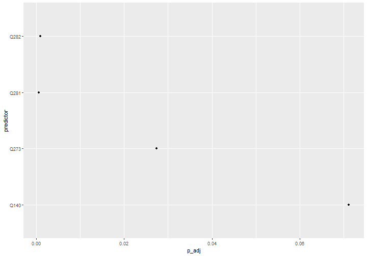
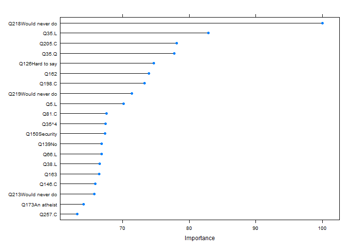

```r
library(tidyverse)
library(here)
library(broom)
library(caret)
library(doParallel)

wvs <- readRDS(here("data", "nzl_coded.RDS")) %>%
  select(H_URBRURAL, matches("Q[0-9]+")) %>%
  mutate(H_URBRURAL = factor(H_URBRURAL,
                             levels = 1:2,
                             labels = c("Urban", "Rural")))
```

## Can we predict urban-rural status?
### Univariate logistic regression model
Fit a univariate logistic regression for every predictor.


```r
predictors <- names(wvs)[-1]
formulae <- map(predictors, reformulate, response = "H_URBRURAL") %>%
  set_names(predictors)
rur_models <- map(formulae, glm, family = binomial(), data = wvs) 
```

Compute a likelihood ratio test statistic, p value and adjusted p value for
each model.


```r
rur_model_summaries <- map_dfr(rur_models, glance, .id = "predictor") %>%
  mutate(lr_t = null.deviance - deviance,
         df = df.null - df.residual,
         p = map2_dbl(lr_t, df, pchisq, lower.tail= FALSE),
         p_adj = p.adjust(p, "BH"))
```

Is anything significant at p < 0.1 after adjustment for multiple comparisons?


```r
rur_model_summaries %>%
  filter(p_adj < 0.1) %>%
  ggplot(aes(p_adj, predictor)) +
  geom_point()
```



The most predictive variables are:

* Q281: To which of the following occupational groups do you belong?
* Q282: To which of the following occupational groups does your spouse belong?
* Q273: Marital/relationship status.
* Q140: Which of the following things have you done for reasons of security:
Preferred not to go out at night.
Examine these models:
top-predictive-models, results="asis"


```r
c("Q140", "Q273", "Q281", "Q282") %>%
  set_names() %>%
  map(~tidy(rur_models[[.x]], exponentiate = TRUE)) %>%
  map(knitr::kable)
```

```
## $Q140
## 
## 
## |term        |  estimate| std.error|  statistic|   p.value|
## |:-----------|---------:|---------:|----------:|---------:|
## |(Intercept) | 0.0662824| 0.2153125| -12.604149| 0.0000000|
## |Q140No      | 2.1590874| 0.2459104|   3.129943| 0.0017484|
## 
## $Q273
## 
## 
## |term                           |  estimate| std.error|   statistic|   p.value|
## |:------------------------------|---------:|---------:|-----------:|---------:|
## |(Intercept)                    | 0.1418182| 0.1209905| -16.1434979| 0.0000000|
## |Q273Living together as married | 0.9584267| 0.3094770|  -0.1372063| 0.8908677|
## |Q273Divorced                   | 0.6559332| 0.5365580|  -0.7859286| 0.4319093|
## |Q273Separated                  | 0.2350427| 1.0237041|  -1.4144594| 0.1572271|
## |Q273Widowed                    | 0.0993139| 1.0136661|  -2.2783337| 0.0227067|
## |Q273Single                     | 0.2670940| 0.4713962|  -2.8005203| 0.0051020|
## 
## $Q281
## 
## 
## |term                                                             |   estimate| std.error|  statistic|   p.value|
## |:----------------------------------------------------------------|----------:|---------:|----------:|---------:|
## |(Intercept)                                                      |  0.1052632| 0.7433919| -3.0284050| 0.0024585|
## |Q281Professional and technical (for example: doctor, teacher, en |  0.9895833| 0.7677481| -0.0136390| 0.9891180|
## |Q281Higher administrative (for example: banker, executive in big |  0.7169811| 0.9063656| -0.3670768| 0.7135617|
## |Q281Clerical (for example: secretary, clerk, office manager, civ |  0.6643357| 0.8121722| -0.5035481| 0.6145790|
## |Q281Sales (for example: sales manager, shop owner, shop assistan |  0.4453125| 0.9494764| -0.8520264| 0.3941995|
## |Q281Service (for example: restaurant owner, police officer, wait |  1.3103448| 0.8335904|  0.3242484| 0.7457500|
## |Q281Skilled worker (for example: foreman, motor mechanic, printe |  1.2547170| 0.7959234|  0.2850903| 0.7755750|
## |Q281Semi-skilled worker (for example: bricklayer, bus driver, ca |  1.9883721| 0.8288537|  0.8292371| 0.4069703|
## |Q281Unskilled worker (for example: labourer, porter, unskilled f |  0.6951220| 0.9541244| -0.3811536| 0.7030892|
## |Q281Farm worker (for example: farm labourer, tractor driver)     |  7.9166667| 0.9588004|  2.1578738| 0.0309376|
## |Q281Farm owner, farm manager                                     | 11.4000000| 0.8578840|  2.8367629| 0.0045573|
## 
## $Q282
## 
## 
## |term                                                             |     estimate| std.error|  statistic|   p.value|
## |:----------------------------------------------------------------|------------:|---------:|----------:|---------:|
## |(Intercept)                                                      | 2.000000e-07|  594.1636| -0.0261983| 0.9790992|
## |Q282Professional and technical (for example: doctor, teacher, en | 7.262106e+05|  594.1636|  0.0227136| 0.9818787|
## |Q282Higher administrative (for example: banker, executive in big | 2.559028e+05|  594.1640|  0.0209581| 0.9832791|
## |Q282Clerical (for example: secretary, clerk, office manager, civ | 5.294541e+05|  594.1637|  0.0221818| 0.9823030|
## |Q282Sales (for example: sales manager, shop owner, shop assistan | 5.431899e+05|  594.1637|  0.0222249| 0.9822686|
## |Q282Service (for example: restaurant owner, police officer, wait | 8.426068e+05|  594.1637|  0.0229638| 0.9816792|
## |Q282Skilled worker (for example: foreman, motor mechanic, printe | 5.700805e+05|  594.1636|  0.0223062| 0.9822037|
## |Q282Semi-skilled worker (for example: bricklayer, bus driver, ca | 5.905449e+05|  594.1638|  0.0223656| 0.9821564|
## |Q282Unskilled worker (for example: labourer, porter, unskilled f | 7.677084e+05|  594.1638|  0.0228071| 0.9818041|
## |Q282Farm worker (for example: farm labourer, tractor driver)     | 4.935268e+06|  594.1638|  0.0259388| 0.9793061|
## |Q282Farm owner, farm manager                                     | 5.397950e+06|  594.1637|  0.0260897| 0.9791858|
```

## Random forest
Are there non-linearities in the predictors? We might find different
predictor importances with a non-linear regression method.

We're going to want all of our cores for this: start a cluster.


```r
cl <- makePSOCKcluster(detectCores() - 1)
registerDoParallel(cl)

rf_control <- trainControl(verboseIter = TRUE,
                           allowParallel = TRUE)
```

Fit a random forest.


```r
rf_model <- train(H_URBRURAL ~ .,
                  data = wvs,
                  method = "ranger",
                  na.action = "na.omit",
                  trControl = rf_control,
                  tuneLength = 10,
                  importance = "impurity",
                  num.trees = 10000)
```

```
## Warning in nominalTrainWorkflow(x = x, y = y, wts = weights, info = trainInfo, : There were missing
## values in resampled performance measures.
```

```
## Aggregating results
## Selecting tuning parameters
## Fitting mtry = 2, splitrule = gini, min.node.size = 1 on full training set
```

```r
stopCluster(cl)

rf_model$finalModel
```

```
## Ranger result
## 
## Call:
##  ranger::ranger(dependent.variable.name = ".outcome", data = x,      mtry = min(param$mtry, ncol(x)), min.node.size = param$min.node.size,      splitrule = as.character(param$splitrule), write.forest = TRUE,      probability = classProbs, ...) 
## 
## Type:                             Classification 
## Number of trees:                  10000 
## Sample size:                      10 
## Number of independent variables:  763 
## Mtry:                             2 
## Target node size:                 1 
## Variable importance mode:         impurity 
## Splitrule:                        gini 
## OOB prediction error:             30.00 %
```

```r
rf_importance <- varImp(rf_model)
```

Which variables contribute the most to the random forest?


```r
plot(rf_importance, top = 20)
```



These estimates seem to be extremely unstable: re-training the random forest
yields a new set of important predictors each time. However, with repeated
runs, a few predictors repeatedly float to the top: Q162, Q126 ("Hard to
say"), Q213, ("Would never do"), Q217 ("Would never do"), Q218 ("Would never
do"), Q286 ("Spent some savings and borrowed money"), Q173 ("An atheist".)

These are:

* Q126: Immigration increases the risks of terrorism ("Hard to say").
* Q162: It is not important for me to know about science in my daily life.
* Q173: Independently of whether you attend religious services or not, would
you say you are…? ("An atheist")
* Q213: Political actions: donating to a group or campaign ("Would never do")
* Q217: Political actions using the internet: Searching information about
politics and political events ("Would never do")
* Q218: Political actions using the internet: Signing an electronic petition
("Would never do")
* Q286:  During the past year, did your family ("Spent some savings and borrowed money")
