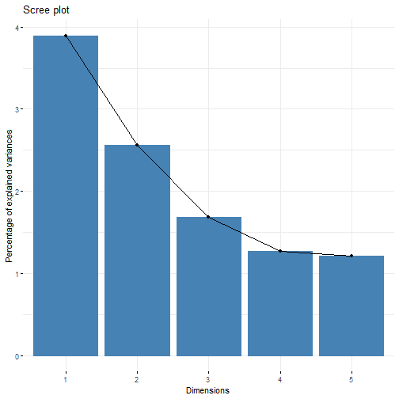

```r
library(tidyverse, quietly = TRUE)
library(here, quietly = TRUE)
library(FactoMineR)
library(factoextra)
library(missMDA)
```

```r
wvs <- readRDS(here("data", "nzl_coded.RDS")) %>%
  select(starts_with("Q"),
         -Q_MODE)

# Factor analysis of mixed data (FAMD)

wvs_impute <- imputeFAMD(wvs)
wvs_famd <- FAMD(wvs, tab.disj = wvs_impute$tab.disj, graph = FALSE)

fviz_screeplot(wvs_famd)
```



```r
fviz_famd_ind(wvs_famd)
```


The plots suggest there probably isn't much point in performing FAMD over the
whole set of questions. What about subsets?
