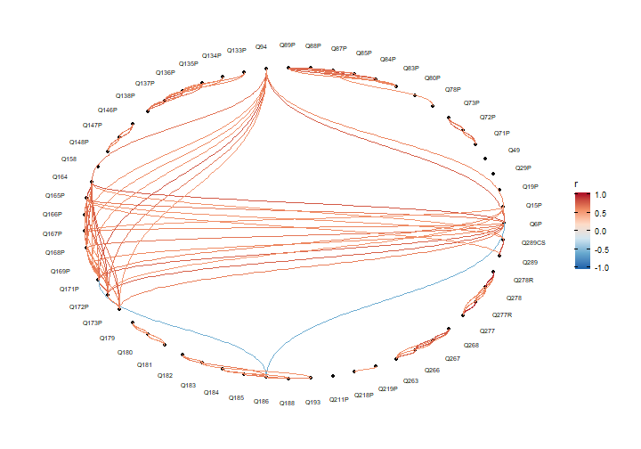

```r
knitr::opts_chunk$set(echo = TRUE, message = FALSE, warn = FALSE, fig.width = 10)
```

```r
library(tidyverse)
library(here)
library(naniar)
library(tidygraph)
library(ggraph)
library(lubridate)
library(countrycode)
```


## File input


```r
nzl_raw <- read_csv(here("data/NZL.csv"))
```


## Missingness?


```r
nzl_missing <- nzl_raw %>%
  select(starts_with("Q")) %>%
  mutate(across(where(is.numeric), ~if_else(.x %in% -1:-5, NA_real_, .x)))

# Case-wise completeness?
pct_complete_case(nzl_missing)
```

```
## [1] 0
```

```r
# Variable-wise completeness?
pct_complete_var(nzl_missing)
```

```
## [1] 5.033557
```

```r
# Cell-wise completeness?
pct_complete(nzl_missing)
```

```
## [1] 90.39989
```

### Demographics missingness?

**Notable**: patterns of missingness are structural. For example, people who
have missing data for spouse education also have missing data for spouse
income - because they don't have a spouse. NMAR. Imputation not sensible in
these cases.


```r
nzl_missing %>%
  select(starts_with(paste0("Q", 260:287))) %>%
  gg_miss_upset(nsets = 10)
```


## Rural vs city (small town vs bigger town)

Overwhelmingly city respondents:


```r
nzl_raw %>%
  select(H_SETTLEMENT, H_URBRURAL) %>%
  mutate(across(.fns = as.factor)) %>%
  summary()
```

```
##  H_SETTLEMENT H_URBRURAL
##  -5: 63       1:950     
##  1 :824       2:107     
##  2 :170
```


However, a uniform-ish range of town sizes:


```r
nzl_raw %>%
  select(starts_with("G_")) %>%
  pivot_longer(everything()) %>%
  mutate(value = factor(value)) %>%
  ggplot(aes(value)) +
  geom_bar() +
  facet_wrap(~name)
```


## News sources


```r
nzl_news <- nzl_raw %>%
  select(starts_with(paste0("Q", 201:208))) %>%
  pivot_longer(everything()) %>%
  mutate(value = factor(value,
                        levels = 1:5,
                        labels = c("Daily", "Weekly", "Monthly",
                                   "Less than monthly", "Never")))


ggplot(nzl_news, aes(value)) +
  geom_bar() +
  facet_wrap(~name) +
  theme(axis.text.x = element_text(angle = 90, hjust = 1))
```


```r
nzl_news %>%
  mutate(name = fct_collapse(name,
                             "Old media" = c("Q201P", "Q202P", "Q203P"),
                             "New media" = c("Q204P", "Q205P", "Q206P", "Q207P"),
                             "Word of mouth" = c("Q208P"))) %>%
  ggplot(aes(value)) +
  geom_bar() +
  facet_wrap(~name) +
  theme(axis.text.x = element_text(angle = 90, hjust = 1))
```


## Correlations?

Scale everything and compare. Religion seems to come out as being the
strongest association with other values.


```r
# Scale and compute Pearson's correlation
nzl_corr <- nzl_missing %>%
  select(starts_with("Q")) %>%
  select(-Q_MODE)  %>%
  mutate(across(everything(),  scale)) %>%
  cor(use = "pairwise")

# Build a correlation network
nzl_corr_graph <- as_tbl_graph(nzl_corr, directed = FALSE)

# Filter out the low correlations and visualise
nzl_corr_trimmed <- nzl_corr_graph %>%
  activate(edges) %>%
  filter(from != to) %>%
  top_n(150, abs(weight)) %>%
  activate(nodes) %>%
  filter(centrality_degree() > 1)

  ggraph(nzl_corr_trimmed, layout = "circle")+
  geom_node_point() +
  geom_edge_diagonal(aes(colour = weight)) +
  geom_node_text(aes(label = name, x = x * 1.15, y = y * 1.15), size = 2.5) +
  scale_edge_colour_distiller(type = "div",
                              palette = "RdBu",
                              limits = c(-1, 1),
                              name = "r") +
  theme_graph()
```

```
## Warning in grid.Call(C_stringMetric, as.graphicsAnnot(x$label)): font family not
## found in Windows font database

## Warning in grid.Call(C_stringMetric, as.graphicsAnnot(x$label)): font family not
## found in Windows font database
```

```
## Warning in grid.Call(C_textBounds, as.graphicsAnnot(x$label), x$x, x$y, : font
## family not found in Windows font database

## Warning in grid.Call(C_textBounds, as.graphicsAnnot(x$label), x$x, x$y, : font
## family not found in Windows font database
```



## Interview date distribution

Binwidth is weeks.


```r
interview_dates <- nzl_raw %>%
  select(J_INTDATE) %>%
  mutate(J_INTDATE = ymd(J_INTDATE))
```

When were most of the responses received?


```r
halfway <- median(interview_dates$J_INTDATE)
halfway
```

```
## [1] "2019-08-20"
```

Is there a pattern to the response dates?


```r
ggplot(interview_dates, aes(J_INTDATE)) +
  geom_histogram(binwidth = 7) +
  scale_x_date(breaks = "month", date_labels = "%B\n%Y") +
  geom_vline(xintercept = halfway,
             linetype = "dashed") +
  annotate("text",
           x = halfway + 7,
           y = 125,
           label = paste("Half received by",
                         strftime(halfway, "%d %b %Y")),
           hjust = 0) +
  labs(x = "Interview date")
```


## Demographic EDA
Coding some factors and cleaning here. @TODO: move these to a separate data 
cleaning script (after EDA).


```r
nzl_demogs <- nzl_raw %>%
  select(starts_with(paste0("Q", 260:287))) %>%
  mutate(Q260 = factor(Q260, levels = 1:2, labels = c("M", "F")),
         Q261 = if_else(!between(Q261, 1889, 2019), NA_real_, Q261),
         Q262 = if_else(!between(Q262, 18, 120), NA_real_, Q262),
         across(c(Q263, Q264, Q265),
                ~factor(.x, 1:2, labels = c("Native", "Immigrant"))),
         across(c(Q266, Q267, Q268),
                 ~countrycode(.x, origin = "iso3n", destination = "country.name")),
         Q269 = factor(Q269, 1:2, labels = c("Citizen", "Non-citizen")))
```

```
## Warning in countrycode(.x, origin = "iso3n", destination = "country.name"): Some values were not matched unambiguously: -5, 9999

## Warning in countrycode(.x, origin = "iso3n", destination = "country.name"): Some values were not matched unambiguously: -5, 9999

## Warning in countrycode(.x, origin = "iso3n", destination = "country.name"): Some values were not matched unambiguously: -5, 9999
```

Age-sex distribution?


```r
sex_table <- with(nzl_demogs, table(Q260))
sex_table
```

```
## Q260
##   M   F 
## 440 594
```

```r
sex_table / (sum(sex_table))
```

```
## Q260
##         M         F 
## 0.4255319 0.5744681
```

```r
ggplot(nzl_demogs, aes(Q262, fill = Q260)) +
  geom_histogram(position = position_dodge(), binwidth = 5) 
```

```
## Warning: Removed 29 rows containing non-finite values (stat_bin).
```


```r
ggplot(nzl_demogs, aes(Q260, Q262, fill = Q260)) +
  geom_boxplot()
```

```
## Warning: Removed 29 rows containing non-finite values (stat_boxplot).
```


Immigration and country of origin?
Respondent:


```r
with(nzl_demogs, table(Q263))
```

```
## Q263
##    Native Immigrant 
##       797       234
```

Mother


```r
with(nzl_demogs, table(Q264))
```

```
## Q264
##    Native Immigrant 
##       855       166
```

Father


```r
with(nzl_demogs, table(Q265))
```

```
## Q265
##    Native Immigrant 
##       837       172
```

