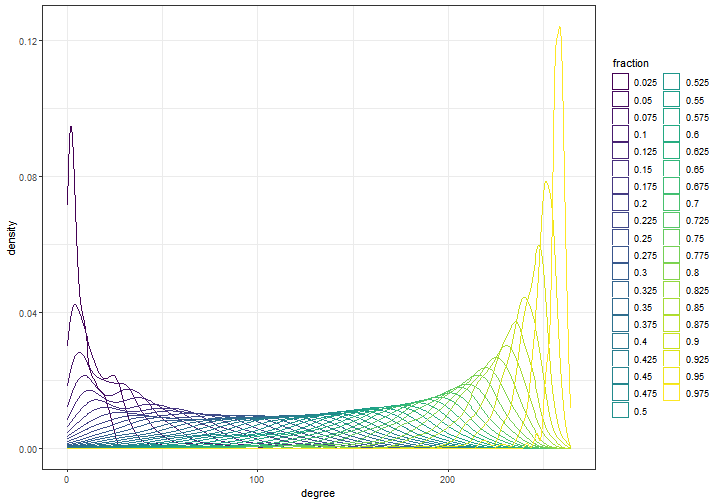
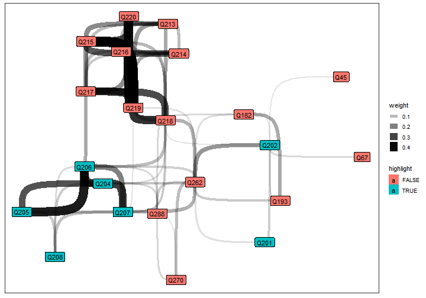

```r
library(here)
library(tidyverse)
library(WGCNA)
library(polycor)
library(ggraph)
library(tidygraph)

windowsFonts("Arial Narrow" = windowsFont("Arial"))
theme_set(theme_bw())
theme_rotate_x <- theme(axis.text.x = element_text(angle = -90,
                                                   hjust = 0,
                                                   vjust = 0.5))
```

Load the data and select question variables.


```r
wvs_q <- readRDS(here("data", "nzl_coded.RDS")) %>%
  select(H_URBRURAL,
         matches(paste0("Q", c(1:260, 262, 269, 270, 274, 287, 288), "$"))) %>%
  mutate(H_URBRURAL = factor(H_URBRURAL,
                             levels = 1:2,
                             labels = c("Urban", "Rural")))
```

Compute heterogeneous correlation matrix. This is very computationally
expensive, so cache the result as RDS.


```r
if (file.exists(here("data", "cor.RDS"))){
  wvs_q_cor <- readRDS(here("data", "cor.RDS"))
} else {
  wvs_q_cor <- hetcor(wvs_q, use = "pairwise")
  saveRDS(wvs_q_cor, here("data", "cor.RDS"))
}

wvs_abs <- abs(wvs_q_cor$correlations)
wvs_sqr <- wvs_q_cor$correlations^2
```

Visualise correlation matrix


```r
wvs_sqr %>%
  as_tibble(rownames = "from") %>%
  pivot_longer(-from, names_to = "to") %>%
  ggplot(aes(from, to, fill = value)) +
  geom_raster() +
  scale_fill_viridis() +
  coord_fixed()
```


# Soft thresholding
Find an appropriate soft threshold to consider variables joined by an edge:


```r
sft <- pickSoftThreshold.fromSimilarity(wvs_abs, moreNetworkConcepts = TRUE)
```

```
##    Power SFT.R.sq  slope truncated.R.sq mean.k. median.k. max.k.  Density
## 1      1   0.0849 -0.616        0.91100 28.9000  2.94e+01  51.40 0.110000
## 2      2   0.4530 -0.957        0.96000  6.1600  5.53e+00  16.60 0.023300
## 3      3   0.8510 -1.490        0.91500  2.0900  1.51e+00   9.72 0.007930
## 4      4   0.9350 -1.530        0.91900  0.9970  5.38e-01   7.21 0.003780
## 5      5   0.2730 -2.850        0.14800  0.5890  2.43e-01   5.83 0.002230
## 6      6   0.9590 -1.420        0.95200  0.3960  1.17e-01   4.98 0.001500
## 7      7   0.2080 -2.830       -0.01770  0.2890  6.41e-02   4.35 0.001090
## 8      8   0.2340 -2.180        0.03960  0.2210  3.87e-02   3.86 0.000838
## 9      9   0.2620 -2.130        0.15700  0.1760  2.20e-02   3.45 0.000665
## 10    10   0.2560 -2.700        0.11800  0.1430  1.30e-02   3.11 0.000543
## 11    12   0.2080 -2.620       -0.01700  0.1010  5.05e-03   2.57 0.000383
## 12    14   0.2110 -1.640       -0.01260  0.0754  1.72e-03   2.16 0.000286
## 13    16   0.2340 -1.630        0.03570  0.0586  5.60e-04   1.85 0.000222
## 14    18   0.9450 -1.040        0.93900  0.0470  2.10e-04   1.60 0.000178
## 15    20   0.1250 -1.130       -0.00562  0.0387  7.67e-05   1.39 0.000147
##    Centralization Heterogeneity
## 1         0.08600         0.286
## 2         0.03990         0.549
## 3         0.02910         0.872
## 4         0.02370         1.250
## 5         0.02000         1.620
## 6         0.01750         1.940
## 7         0.01550         2.220
## 8         0.01390         2.460
## 9         0.01250         2.670
## 10        0.01130         2.860
## 11        0.00943         3.190
## 12        0.00797         3.480
## 13        0.00683         3.750
## 14        0.00591         4.000
## 15        0.00516         4.230
```

```r
sft$fitIndices
```

```
##    Power   SFT.R.sq      slope truncated.R.sq     mean.k.    median.k.    max.k.
## 1      1 0.08494063 -0.6157146    0.911425505 28.91268498 2.935297e+01 51.436826
## 2      2 0.45315112 -0.9573767    0.959991301  6.15513727 5.532035e+00 16.616736
## 3      3 0.85076932 -1.4873887    0.914917551  2.09271834 1.505150e+00  9.715364
## 4      4 0.93546059 -1.5294116    0.919292983  0.99710734 5.376035e-01  7.212439
## 5      5 0.27268136 -2.8503725    0.148179596  0.58929268 2.434459e-01  5.828139
## 6      6 0.95934735 -1.4156213    0.952098917  0.39633007 1.169816e-01  4.982685
## 7      7 0.20839799 -2.8327256   -0.017683697  0.28850864 6.407867e-02  4.352144
## 8      8 0.23351373 -2.1761512    0.039623485  0.22112819 3.869269e-02  3.855113
## 9      9 0.26234661 -2.1289304    0.156512464  0.17568183 2.200690e-02  3.449224
## 10    10 0.25609836 -2.6984059    0.117886124  0.14333298 1.304082e-02  3.109679
## 11    12 0.20751433 -2.6206549   -0.016962134  0.10109362 5.045032e-03  2.571597
## 12    14 0.21115430 -1.6365804   -0.012589601  0.07541368 1.722311e-03  2.164492
## 13    16 0.23418118 -1.6291129    0.035682162  0.05861722 5.603814e-04  1.847328
## 14    18 0.94549511 -1.0440261    0.939054769  0.04703985 2.104081e-04  1.595035
## 15    20 0.12490610 -1.1279801   -0.005624271  0.03872987 7.674128e-05  1.391015
##         Density Centralization Heterogeneity
## 1  0.1095177461    0.085967529     0.2858080
## 2  0.0233149139    0.039928618     0.5487956
## 3  0.0079269634    0.029093230     0.8716794
## 4  0.0037769217    0.023721956     1.2522224
## 5  0.0022321692    0.019995022     1.6212348
## 6  0.0015012503    0.017504667     1.9446072
## 7  0.0010928357    0.015509611     2.2214860
## 8  0.0008376068    0.013869770     2.4606042
## 9  0.0006654615    0.012494076     2.6708452
## 10 0.0005429279    0.011321604     2.8592854
## 11 0.0003829304    0.009429132     3.1906028
## 12 0.0002856579    0.007973351     3.4822285
## 13 0.0002220349    0.006826944     3.7486040
## 14 0.0001781813    0.005908208     3.9966780
## 15 0.0001467041    0.005161244     4.2292330
```

```r
sft$powerEstimate
```

```
## [1] 3
```

```r
# TODO: plot fit indices
```

Find the adjacency matrix.


```r
wvs_adj <- adjacency.fromSimilarity(wvs_abs,
                                    power = sft$powerEstimate) %>%
  `class<-`("matrix") %>%
  `diag<-`(0)
```

Find a topological overlap matrix.


```r
wvs_tom <- TOMsimilarity(wvs_adj)
```

```
## ..connectivity..
## ..matrix multiplication (system BLAS)..
## ..normalization..
## ..done.
```

```r
wvs_tom_dis <- 1 - wvs_tom
```

Cluster questions using topological overlap


```r
wvs_tree <- fastcluster::hclust(as.dist(wvs_tom_dis), method = "average")

plot(wvs_tree)
```


Find question modules.


```r
q_mods <- cutreeDynamic(wvs_tree, distM = wvs_tom_dis, deepSplit = 4)
```

```
##  ..cutHeight not given, setting it to 0.995  ===>  99% of the (truncated) height range in dendro.
##  ..done.
```

```r
table(q_mods)
```

```
## q_mods
##  0  1  2  3  4  5 
## 46 50 49 46 45 29
```

```r
# Build the network and assign survey questions to their modules.
wvs_net <- as_tbl_graph(wvs_adj, directed = FALSE) %>%
  activate(nodes) %>%
  mutate(module = factor(q_mods, levels = 1:5))

# Look at degree distributions:
wvs_deg_dists <- map_dfr(set_names(seq(0.025, 0.975, by = 0.025)) ,
                         function(fraction) {
                           wvs_net %>%
                             activate(edges) %>%
                             top_frac(fraction, weight) %>%
                             activate(nodes) %>%
                             mutate(degree = centrality_degree()) %>%
                             as_tibble()
                         },
                         .id = "fraction")

ggplot(wvs_deg_dists, aes(degree, colour = fraction)) +
  geom_density() +
  scale_colour_viridis_d()
```



 Visualise top 0.05 strongest associations.


```r
wvs_net_reduced <- wvs_net %>%
  activate(nodes) %>%
  #filter(module != 0) %>%
  activate(edges) %>%
  top_frac(0.05, weight) %>%
  activate(nodes) %>%
  filter(centrality_degree() > 0,
         !node_is_isolated()) %>%
  mutate(neighbours1 = local_members(order = 1),
         neighbours2 = local_members(order = 2))

ggraph(wvs_net_reduced, layout = "fr") +
  geom_edge_bend(aes(width = weight, alpha = weight)) +
  geom_node_label(aes(label = name,
                      fill = module),
                  alpha = 3/4,
                  size = 2) +
  theme(legend.position = "none")
```


### Examine neighbourhoods of interest
Urban vs rural
--------------


```r
urbrural_tree <- wvs_net_reduced %>%
  convert(to_local_neighborhood,
          node = which(.N()$name == "H_URBRURAL"),
          order = 2)

urbrural_tree %>%
  ggraph(layout = "kk") +
  geom_edge_link() +
  geom_node_label(aes(label = name))
```


The only real association seems to be with Q189.


```r
ggplot(wvs_q, aes(H_URBRURAL, Q189)) +
  geom_violin()
```

```
## Warning: Removed 30 rows containing non-finite values (stat_ydensity).
```


```r
wvs_q %>%
  group_by(H_URBRURAL) %>%
  summarise(Q189_mean = mean(Q189, na.rm = TRUE))
```

```
## # A tibble: 2 x 2
##   H_URBRURAL Q189_mean
##   <fct>          <dbl>
## 1 Urban           1.15
## 2 Rural           1.01
```

It seems there are a couple of outliers in the urban group who think it is
"Always justifiable for a man to beat his wife".
Sources of news
---------------


```r
news_q <- paste0("Q", 201:208)

news_neighbours <- wvs_net_reduced %>%
  activate(nodes) %>%
  filter(name %in% news_q) %>%
  as_tibble() %>%
  pull(neighbours1) %>%
  unlist() %>%
  append(201:208) %>%
  unique()

# news_neighbourhood <- wvs_net_reduced %>%
#    activate(nodes) %>%
#    filter(node_distance_from(nodes = which(.N()$name %in% news_q),
#                              mode = "all") <= 2)

news_neighbourhood <- wvs_net_reduced %>%
  activate(nodes) %>%
  filter(1:nrow(.N()) %in% news_neighbours) %>%
  mutate(highlight = name %in% news_q)

ggraph(news_neighbourhood) +
  geom_edge_bend(aes(alpha = weight, width = weight)) +
  geom_node_label(aes(label = name, fill = highlight))
```



```r
news_neighbourhood %>%
  activate(nodes) %>%
  as_tibble
```

```
## # A tibble: 22 x 5
##    name  module neighbours1 neighbours2 highlight
##    <chr> <fct>  <list>      <list>      <lgl>    
##  1 Q45   3      <int [8]>   <int [76]>  FALSE    
##  2 Q67   2      <int [22]>  <int [86]>  FALSE    
##  3 Q182  1      <int [41]>  <int [157]> FALSE    
##  4 Q193  1      <int [28]>  <int [98]>  FALSE    
##  5 Q201  4      <int [3]>   <int [21]>  TRUE     
##  6 Q202  4      <int [8]>   <int [90]>  TRUE     
##  7 Q204  4      <int [9]>   <int [46]>  TRUE     
##  8 Q205  4      <int [5]>   <int [11]>  TRUE     
##  9 Q206  4      <int [9]>   <int [46]>  TRUE     
## 10 Q207  4      <int [9]>   <int [39]>  TRUE     
## # ... with 12 more rows
```

```r
# news_tree <- map(news_q,
#                  function(question){
#                    subgraph <- wvs_net_reduced %>%
#                      convert(to_local_neighborhood,
#                              node = which(.N()$name == question),
#                              order = 2)
#                    subgraph
# })
```

# Hard thresholding experiment


```r
# hard <- pickHardThreshold.fromSimilarity(wvs_abs)
# hard$cutEstimate
# 
# hard_adj <- signumAdjacencyFunction(wvs_abs, hard$cutEstimate)
# 
# hard_net <- as_tbl_graph(hard_adj, directed = FALSE) 
#   
# hard_net %>%
#   activate(nodes) %>%
#   filter(centrality_degree(mode = "all", loops = FALSE) >= 1,
#          !node_is_isolated()) %>%
#   ggraph(layout = "dh") +
#   geom_edge_link() +
#   geom_node_label(aes(label = name), size = 2.25) +
#   theme_graph() +
#   theme(legend.position = "bottom")
```

